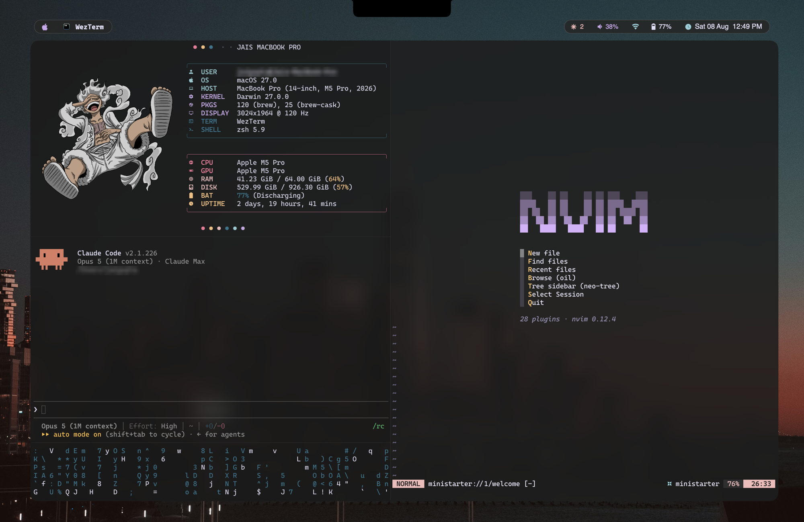
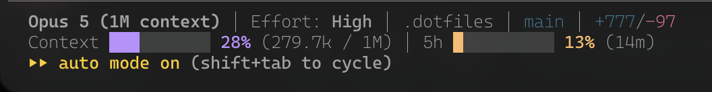

# jai's dotfiles

  

## Overview:

These are my config files for the tools I use most, on MacOS and Linux.
I have organized the dotfiles into home/, home-macos/, and home-linux/. Most configuration lives within the home directory, with OS-specific config, mostly relating to themes & colorschemes, living in their respective OS-specific home directories.

- homebrew: An up-to-date backup of the packages, apps (casks), fonts, taps, etc. I keep installed on my Macbook @ [`Brewfile`](Brewfile)
- home/: Contains the OS-agnostic configurations of Neovim, WezTerm, zsh, etc.
- home-macos: Mostly macOS-specific colorscheme config for my tools (a modified Rosé Pine), but also macOS-specific tools like Sketchybar
- home-linux: Linux-specific configurations for Hyprland, Noctalia v5, etc. + colorscheme config (Noctalia-v5 Matugen-esque Wallpaper-driven)

## Installation:

[`install.sh`](install.sh) symlinks my dotfiles into the real home directory, file by file. Git controls what gets linked. Created w/ the help of Claude Code.

| Commands                              |                                                                                                                                                                             |
| :------------------------------------ | :-------------------------------------------------------------------------------------------------------------------------------------------------------------------------- |
| `./install.sh`                        | Links everything. Correct links are left alone.                                                                                                                             |
| `./install.sh --dry`                  | Prints the plan without actually linking anything.                                                                                                                          |
| `./install.sh --check`                | Verifies that every symlink is intact.                                                                                                                                      |
| `./install.sh --adopt <path>…`        | Takes a new dotfile in your home directory into the repo: move it to the mirrored path, `git add` it, symlink it back. A directory adopts every file inside, one link each. |
| `./install.sh --adopt --os <path>`    | Adopts into an OS-specific tree instead of `home/`.                                                                                                                         |
| `./install.sh --adopt --force <path>` | Skips the credential/token/secret scanner.                                                                                                                                  |
| `-h`, `--help`                        | Usage.                                                                                                                                                                      |

## Tools:

### Editor - Neovim

### Terminal - WezTerm

### AI - Claude Code

### CLI Tools:

- fastfetch: a fun way to see info about my system
- zoxide: super useful navigation (cd replacement); powers shortcuts like cc and nv for me to quickly open Claude or Neovim in any directory from anywhere.
- fzf & fzf-tab: replacing zsh's completion menu with fzf.
- zsh-autosuggestions: can't live without it.
- Fun Stuff: cmatrix, sl, cbonsai, asciiquarium (for wasting time)
